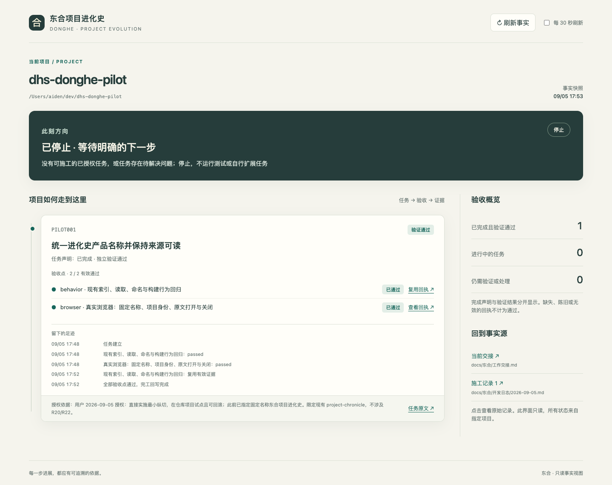

# 东合施工队 v0.6.0 最小纵切试点回执

2026-09-05。结论：首条「授权任务 → 验证 → 可恢复完工 → 进化史查看 → 停止」已实测通过；完整产品整合尚未交付。

## 实际改造

- `scripts/donghe.py`：标准库 CLI，固定 `docs/东合/` 产物目录；按验收契约执行命令并保存原始输出、输入指纹、摘要。
- `finish`：统一回写卡、当日日志、当前交接；中断可恢复，重复执行不重复落账；`abort` 可撤销未完成事务，用户冲突不会被覆盖。
- `assets/evolution.html`：任务历程、验收状态、原始证据抽屉；完成声明与证据有效性分开。
- 技能入口新增按需加载 playbook 09；删除无人值守“必须跑满”“无目标补卡”和未授权自动下放。同步精简旧无人值守模板，避免入口与模板互相冲突。

## 实测证据

| 验证 | 结果与边界 |
|---|---|
| 新工具内核 | 22/22：[父代理运行输出](core-tests.txt)，完整用例在 tests/test_donghe.py |
| 六类原始行为问题 | 覆盖无目标停止、正常完工、中断恢复、证据复用、源码漂移、后端通过但 UI 缺证据；这是确定性回归，不是新一轮模型对照 |
| 旧夹具自身回归 | 7/7；旧版 12 份原生模型回执未修改 |
| 真实回光项目工具 | 6/6 索引/来源读取/构建测试；命名断言并入原有构建用例 |
| 真实回光页面 | 固定产品名、单独项目身份、原文打开/关闭、无页面异常，实际 Chromium 验证 |
| 新进化史界面 | [9 项浏览器检查](evolution-ui-result.json)：真实已完工任务与来源 + 独立空/陈旧/失败/刷新错误反证；390px 无横向溢出 |
| 真实完工中断与复用 | [逐步回执](pilot-recovery.json)：复用未增加回执；中断不算完成；恢复后三份来源一致；重复 finish 不改文件；最终 stop |
| 回滚 | [Git 树证据](rollback.json)：先撤销治理回执提交，再撤销代码提交，完整文件树与起点一致 |
| 技能 lint | 通过：SKILL 92/120 行；playbooks 共 760/1600 行；四处版本一致 |

浏览器未只验证 API：已实际点击回执、任务原文和交接，检查内容与来源一致，关闭后焦点恢复。视觉复核发现手机按钮竖排，已修复并复验。



[手机截图](evolution-mobile.png)。旧编年史本次只做固定名称的真实试点任务；没有把其全部历史索引迁入新技能界面。

## 隔离位置与回滚

- 技能源码：`/Users/aiden/dev/donghe-first-slice`，分支 `codex/first-user-slice`；改造前检查点 `afaefb28926f9bf642f107b9bebad0a0b697621e`。
- 回光试点：`/Users/aiden/dev/dhs-donghe-pilot`，分支 `codex/donghe-pilot`；起点 `c3cc727aeca47cdb38d0d98871e8dfb85a81368d`。
- 代码提交 `6e26d50a89410019d9ada1b27933c9fb69a68684`；治理回执提交 `a0790174`。
- 回滚演练工作区：`/Users/aiden/dev/dhs-donghe-rollback-check`；两次 revert 后为 `5b8f0734`，Git tree 与起点相同。证据仍留在试点分支和本回执中。
- 原 `/Users/aiden/dev/dhs-paiban-main` 及已安装技能副本未被本轮修改；未推送、未合并。

仅在试点分支需要撤销时，依次 `git revert a0790174`、`git revert 6e26d50a`；不要对原业务工作区执行重置。也可以继续保留隔离分支，不迁入主项目。

查看当前试点：

```sh
cd /Users/aiden/dev/donghe-first-slice
python3 scripts/donghe.py --project /Users/aiden/dev/dhs-donghe-pilot serve --port 4318
```

打开本地 `http://127.0.0.1:4318`；本轮结束时已保留服务。CLI 当前队列返回 stop。

## 仍有的限制

当前依赖本机 Python 3.9+（macOS/Linux）；未打包跨平台运行时。试点复用原仓库已装依赖和本机 Chromium，没有要求用户安装额外依赖，但这不证明“任意机器安装一次即用”。
证据覆盖显式 inputs 与命令可执行文件；外部依赖和在线状态不能自动证明新鲜度。浏览器契约设为不可复用。只读权限与摘要用于误改检测，不能抵抗同一账户同时重写回执和摘要。
事务提供进程中断恢复，不宣称多文件原子提交或断电级数据库耐久性。事务绑定原项目绝对路径，搬迁项目需要后续迁移协议。
第三方图谱、自动归档、九类资料完整关联、旧历史回填和全局安装升级仍按后续契约推进。本轮不据此宣称模型质量已提高或 token 已节省某个比例。
